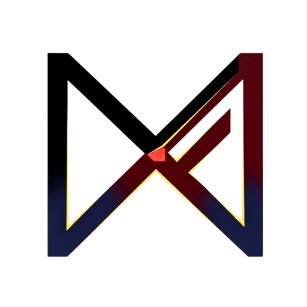

  

<h1 align="center">Mike Richard</h1>

Architect &nbsp;·&nbsp; Enterprise AI &nbsp;·&nbsp; Microsoft Business Applications

  
  &nbsp;
  
  &nbsp;
  
  &nbsp;
  

---

  I design and direct enterprise-scale Agentic AI and Microsoft Business Applications programmes — 
  leading complex transformations, rescuing failing programmes, and building AI-first delivery capability 
  across teams of up to 70 in financial services, legal, public sector, healthcare, and FMCG.

## 🧠 Personal AI Systems

> The systems below run the same architecture outlined above — personal environments where I
> continuously iterate on the latest agent patterns, protocols, and standards. That learning
> feeds directly into enterprise implementation.

| System | What it is |
|---|---|
| 🐦 **Raven** | Personal AI orchestrator — specialist agents, persistent memory, hooks, and scheduled routines built on Claude Code |
| 🔥 **Fawkes** | Work AI orchestrator — same multi-agent architecture applied to Microsoft 365 workflows and delivery operations |
| 🐉 **Drogon** | Local AI rig — offline model inference via Ollama + Open WebUI, private experimentation with no cloud dependency |

---

## 📊 Career at a Glance

<table>
<tr>
<td align="center"><b>16+</b> Years in enterprise Microsoft BA</td>
<td align="center"><b>5×</b> Microsoft FTRSA D365 CE + PP</td>
<td align="center"><b>70</b> Person team led at peak</td>
<td align="center"><b>13</b> Countries Pan-EU D365 migration</td>
<td align="center"><b>200+</b> Programme team Global FMCG (APJ)</td>
<td align="center"><b>4+</b> Deep Red → Green rescues</td>
</tr>
</table>

---

## 🏗️ Tech Stack

**Microsoft Business Applications**

**Azure & Integration**

**AI & Agentic Protocols**

-5C2D91?style=flat-square&logoColor=white)
-5C2D91?style=flat-square&logoColor=white)

---

## 🏆 Recognition & Certifications

**5× Microsoft FastTrack Recognised Solution Architect (FTRSA)**
> 4× Dynamics 365 Customer Engagement (2021 · 2024 · 2025 · 2026) &nbsp;·&nbsp; 1× Power Platform (2026)
>
> One of a select group globally recognised by Microsoft FastTrack across two distinct practice areas.
> → [Microsoft FTRSA page](https://www.microsoft.com/en-us/dynamics-365/fast-track/recognized-solution-architects)

| Certification | Status |
|---|---|
| Microsoft Certified: Power Platform Solution Architect Expert (PL-600) | ✅ Active — Apr 2024 |
| Microsoft Azure AI Fundamentals (AI-900) | ✅ Passed — Jun 2026 |
| [TOGAF 10 Applied Enterprise Architect](https://www.credly.com/badges/55abea13-9f6f-4f06-9839-c07132f66c78/public_url) (Foundation + Practitioner + Applied Practitioner) | ✅ Passed — Jul 2026 |
| Microsoft Certified: Power Platform Functional Consultant Associate (PL-200) | ✅ Active — Jan 2021 |
| AWS Certified Solutions Architect – Associate | ✅ Active |
| Microsoft Certified: Dynamics 365 CE (MB2-703) | ✅ Active |

---

## 📖 Publications

- **Principal author** — [*"Integrate a booking system with Dynamics 365 Customer Service"*](https://learn.microsoft.com/en-us/dynamics365/guidance/reference-architectures/customer-service-integrate-booking-system-appointments) — official Microsoft-published reference architecture, Dynamics 365 Guidance (learn.microsoft.com), credited by name in the article's Contributors section

---

## 💡 Thought Leadership

- **Co-leading a firm-wide AI capability library initiative** — co-originated and actively developing across the practice
- **"AI + Future of Workforce"** — presented three-horizon roadmap to firm leadership
- **CE Summit June 2026** — selected to present the Solution Review Agent
- **GitHub Copilot & Agent Building sessions** — delivered to internal delivery and recruitment teams
- **Writing** — enterprise AI architecture, responsible AI adoption, and real-world agentic deployments → [mgrb.in](https://mgrb.in)

---

